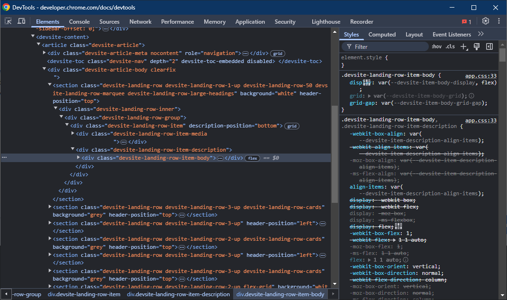

# Debugging Web Applications
When doing web development, bugs are inevitable. Sometimes you will break things, other times you will work on fixing things other people broke, and sometimes you will have no idea why things are broken at all. Being comfortable with that and feeling capable of resolving these issues is critical for success.

# Chrome DevTools
The primary tool you will use for debugging web applications in chromeis [Chrome DevTools](https://developer.chrome.com/docs/devtools). DevTools has a variety of tools that enable you to quickly debug, test, and edit changes to a webpage.

## Getting Started with DevTools
Devtools is installed automatically by Chrome. You can open it by pressing F12 on any webpage. 

When you do this, you will see a variety of **panes** available to you along the top, each pane has a unique purpose. Some of the panes you will use most often are described below. The descriptions below are *not* exhaustive, and you should review the [DevTool Docs](https://developer.chrome.com/docs/devtools) for a complete list of functionality if required. Instead, this page will provide some basics that will help you during your academic journey and early career.

### 1. Elements

The Elements pane provides an interface to view and edit the **DOM**. Functionally for the purpose of this class, you can consider this the HTML that is being rendered, but there are [differences between HTML and the DOM](https://developer.chrome.com/docs/devtools/dom#appendix).

```admonish info

You can open the Elements pane directly to a specific element by right clicking it and clicking Inspect. This makes it very easy to find an element you can see visually, where finding it directly in the DOM might take a while. 
```

In this view, you can edit and manipulate anything you'd like, and you'll immediately see your changes update in the browser. This can be useful if you're not sure how a specific change will impact the view of your page and want to just test and check.

#### Computed

In the Computed Tab of the Elements Pane, you can see exactly what styling is being rendered and why. This is very helpful for debugging CSS, as often you will find the visual behaviour of your CSS isn't what you'd expect. When you select an element, the computed tab will update to show you the CSS attributes the element has. When you drop down the attribute, you can see the Source of where this attribute is coming from, which can help you uncover the root cause of any issues you might be having.

#### Event Listeners 
The Event Listeners tab shows you any active Event Listeners on a particular element. You can use this tab to ensure you have applied custom event listeners correctly, or to confirm why a particular event listener isn't firing when you expect it to.

### 2. Sources
The Sources pane provides an interface to view all files loaded on a page, which allows you to inspect and manipulate the entire source code of a website. This goes beyond the scope of the elements pane, as you can edit CSS, JavaScript, and anything else directly here.

The Sources pane is the source code of your page, and so it is the source of truth. If your page looks entirely wrong, like it might if you had the wrong HTML file loaded, the sources pane will help you uncover the problem.

### 3. Network
The Network tab displays all outbound requests your browser makes, and the responses to them. This will be expanded on significantly in COMP 206 when we are integrating front and back-ends together. 

### 4. Recorder
The Recorder tab allows you to start working with **User Journeys**. When developing web pages, your ultimate goal is to provide a web page that a user is able to interact with. A User Journey is just a set of instructions that a user might use to do something on your site. For example, in order to log in a user might:

1. Load your webpage.
2. Click the Login button.
3. Type in their username.
4. Type in their password.
5. Press enter.

Even this simple user journey can be made [incredibly painful](https://reddit.com/r/badUIbattles/comments/f75dhi/please_select_your_username_and_password/) if you don't think about the end-user experience, and so User Journeys are a helpful way to think about what steps *exactly* are required to do something on your site. 