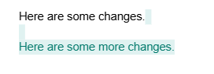

# Introduction to Git
Git is a [version control system](https://www.atlassian.com/git/tutorials/what-is-version-control) (VCS) which allows you to handle changes to code over time. The key difference between a VCS and just saving your file is that a VCS will allow you to "go back in time" and edit things in the past, whereas saving only usually allows you to go back to the last time you saved.

```admonish note title="Installing Git"
During the installation of git, you can generally follow the defaults suggested by the installer. However, when it asks you to select a text editor, you should *not* use the default suggestion of Vim unless you know what you're doing. Select another program such as Notepad++.

To install git, follow the instructions on [Git SCM's Installing Git](https://git-scm.com/book/en/v2/Getting-Started-Installing-Git) guide.

When you have finished installing, you should restart your terminal to ensure the changes take effect.
```

## What is a commit?
A commit is like a snapshot of your code at a single point in time. The way git handles commits is by tracking *changes*, so your commits can be thought of as a series of changes over time. 

| Commit # | Addition                | Deletion | Snapshot                           |
|----------|-------------------------|----------|------------------------------------|
| 1        | Hello World             |          | Hello World                        |
| 2        | , my name is John Smith |          | Hello World, my name is John Smith |
| 3        | Doe                     | Smith    | Hello World, my name is John Doe   |


### Google Drive Example

One example that is usually fairly familiar is the idea of how Google Drive (or most auto-saving document tools) handle saving. You don't have to specify when you'd like to save, instead, Google Drive assembles a list of changes as you type, so you can go back in time.

Then, when viewing the Version History tab, you can see specific changes that you made as differences (or diffs), which are displayed like the image below.



### Commit Flow
Since a commit is a snapshot of a state in time, it represents files in a committed state. While you're doing work, your files will go through the following states:

**Unmodified (No changes)** – The file is identical to the last committed version, meaning no changes have been made since the last commit.

**Modified (Changes unstaged)** – The file has been changed but has not yet been added to the staging area (git add has not been run).

**Staged (Changes staged)** – The file has been added to the staging area using git add, meaning it is ready to be committed.

**Committed** – The file’s changes have been saved in the repository’s history with git commit.

There is also a fifth state when a new file is added to the working directory without being added to git, which is an **untracked file**.

## Basic Usage

At it's core for working with a single branch and single repository, you will do the following actions:

1. Make changes to your code.
2. Add them to the staging area to prepare to make a commit with the command ``git add <files>``.
3. Validate your staging is the way you expect with ``git status``.
4. Commit your files with the command ``git commit -m "<your commit message>"``

This will allow you to use git to help preserve your progress through time.

```admonish warning title="Git is not a backup!"
At its core, git is saving *more things* than saving through your filesystem, but it's not saving in *more locations*. If your laptop dies, or your hard drive fails, you still lose all your work. Do not treat git as though it's a viable backup for your work.

If you put your code in a **private repository** on GitHub it could be considered resembling a backup, but there are still concerns such as relying on GitHub not deleting your repository, which they could do for example in the event of you violating their terms.

**Never commit schoolwork to a public repository on GitHub or any other site, as that is equivalent to sharing your code and is a violation of academic policy.**
```

## What is a branch?
A Git branch is a pointer to a specific commit in your repository's history. When you create a new branch, Git essentially makes a lightweight reference to a commit, allowing you to work independently from the main development line.

This can be helpful, especially when testing or doing work that you may need to throw away. You can do all the work on your separate branch, and then decide whether or not you'll **merge** the branches together.

## What is remote?

Everything up until now assumes you're working independently, but the biggest value add of git is being able to easily share work and collaborate. This is done using a shared **remote repository**. A remote repository is essentially a copy of the local version that is hosted online and accessible to others. When done in this way, the remote repository is usually considered the "true" version of the code, and the local repository is considered your local changes.

Using a remote repository is made easier using a remote hosting service, the most common of which is GitHub. When using GitHub, you will set up a remote version of your repository and keep them in sync using the git commands ``git push`` and ``git pull``, to push up and pull down work respectively.

## Git Command Reference
### Basic Commands 
The basic commands below you are required to know, and should be able to describe their usage on a quiz.

| **Git Command** | **Description** | **Usage** |
|-----------------|-----------------|-----------|
| **git init**    | Initializes a new Git repository in your current directory. This sets up all the necessary Git metadata. | `git init` |
| **git add**     | Stages changes (new, modified, or deleted files) so they are ready to be committed. It tells Git which changes to include in the next commit. | `git add <file>` or `git add .` (to add all changes) |
| **git commit**  | Records the staged changes in the repository's history. A commit should include a message describing the changes. | `git commit -m "Your commit message"` |
| **git log**     | Displays a list of commits in the repository's history, showing details like commit ID, author, date, and commit message. | `git log` (can be used with additional options, e.g., `git log --oneline`) |
| **git status**  | Shows the state of the working directory and staging area, including changes that have been staged, changes not staged, and untracked files. | `git status` |
| **git reset**   | Resets the current HEAD to a specified state. It can be used to unstage files or undo commits, depending on the flags used. | `git reset <commit>` or `git reset --hard <commit>` (to discard changes) |


### Additional Commands
The following additional commands are not required for this course, but you will need them regularly and you may find it useful to understand them.

| **Git Command**     | **Description** | **Usage** |
|---------------------|-----------------|-----------|
| **git stash**      | Saves changes that are not yet committed so you can work on something else without losing progress. It removes the changes from the working directory but keeps them stored for later use. | `git stash` |
| **git stash pop**  | Applies the most recently stashed changes back to the working directory and removes them from the stash list. | `git stash pop` |
| **git revert**     | Creates a new commit that undoes the changes introduced by a previous commit, without modifying the commit history. | `git revert <commit>` |
| **git branch**     | Lists all branches in the repository, creates a new branch, or deletes an existing branch. | `git branch` (list branches) or `git branch <branch-name>` (create a branch) |
| **git checkout**   | Switches to a different branch or restores a specific commit/file. (Deprecated in favor of `git switch` and `git restore` for some use cases.) | `git checkout <branch>` (switch branch) or `git checkout <commit> -- <file>` (restore file) |
